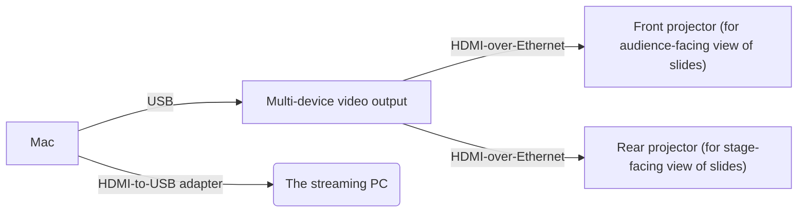

## The Mac

### What is it used for?

The Mac that sits on the right-hand side of the production booth is used primarily for three purposes:

* Editing and displaying the slides for Sunday School, the worship songs, and the sermon.
  * This is done using a program called ProPresenter. ProPresenter is similar to Photoshop in many ways, but has more-powerful features that we use, in particular the ability to "present" different layouts to our two projectors (one layout showing the current slide), and the other layout showing the current slide _along with_ additional information, like the current time, or the words on the next slide.
* Managing the on-stage LED lights
  * This is done using a program called LightKey, which lets us swap between preset lighting combinations (for example, all-lights-on during the worship service so that the music team can better read their music, or only some lights on during Sunday School).  
* Playing videos or audio during the service or during VBS
  * This is not an "every-week" sort of thing, but it's still useful to have that capability ready to go.

The main use-case for the Mac, as you can see, is for the slides (by way of ProPresenter).

ProPresenter is similar in many ways to PowerPoint, but as noted, it has some more-powerful features that we use. For more details on features in ProPresenter that we commonly use, see the "ProPresenter" section of this manual.

### Video connections

The video connections going out from the Mac are as follows:

As you'll notice, there's a video output for the Streaming PC. This is an important connection, because it's how we're able to display the current slide as part of the live-stream broadcast.

**TODO:** verify that USB is used for the Mac -> video_splitter connection

**TODO:** verify that HDMI is used for the Mac -> Streaming PC connection

**TODO:** Write up a brief summary of how the display outputs show up on the Mac when you go to "Settings -> Displays"

### Audio connections

The audio connections from the Mac are as follows:

The audio output here is fairly straightforward: we send audio from the Mac to the sound board (a.k.a. the "mixer"). This is done so that we can have music or sound from any videos we need to show on the projector be audible in the sanctuary (and, if necessary, on the livestream).
