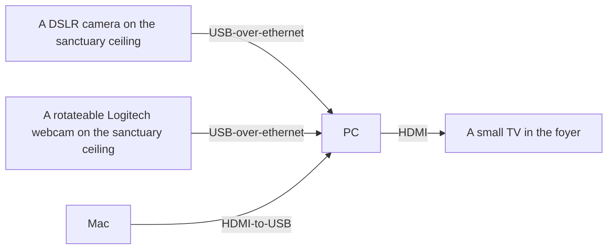
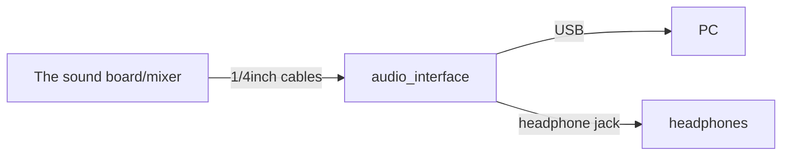

## The Streaming PC 

### What is it used for?

The Streaming PC that sits on the left-hand side of the production booth is used for two purposes:

* The primary purpose is to manage our live-stream broadcast (streaming to YouTube, by way of "Restream.io")
* A secondary purpose is to display the current live-stream feed on a monitor that's in the church foyer, in case someone needs to step back into the foyer and would still like to see and hear the sermon.

Both of these responsibilities are accomplished using free software called "OBS Studio", which is sort of the standard tool for livestreaming, both for individuals and for organizations.

For more details on OBS Studio and how we use it, see the "OBS Studio" section in this manual.

### Video connections

The video connections to and from the Streaming PC are as follows:

As you'll notice, there's a video input from the Mac into the Streaming PC. This is an important connection, because it's how we're able to display the current slide as part of the live-stream broadcast.

### Audio connections

The audio connections for the PC are as follows:

