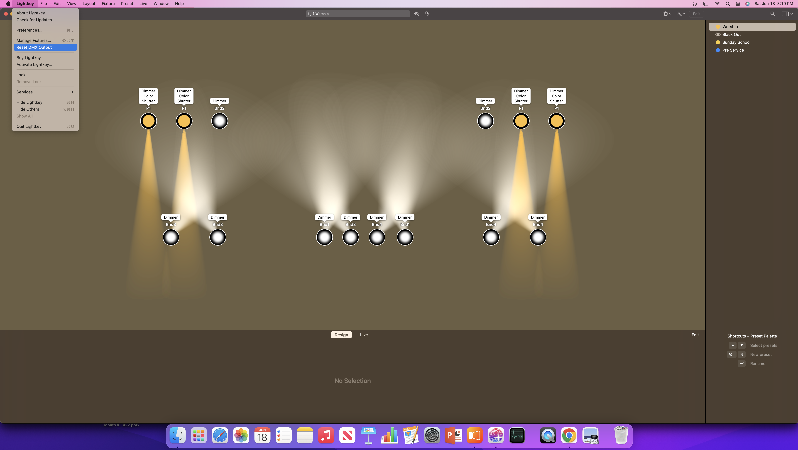

# Sunday Morning Setup

When setting up for Sunday Morning, there are a few procedures we always follow to get everything ready for Sunday School and the regular service. This guide will walk you through all of these steps.

## Turning on switches and power strips

1. Turn on the following light switches:
	1. Projector and Camera
	2. Sequencing
	3. Lights
	4. House Lights (yellow sticker)
	5. Ceiling Dome Lights (yellow sticker)
	6. (Optional) Ceiling Fans -- it's hot here, y'all.
2. Turn on the power strips:
	1. There's a black power strip up against the left wall of the production booth, on the desk.
	2. Check to ensure that all power strips below the desk are turned on.
3. Turn on additional necessary equipment
	1. Turn on the "Mac Video Output" box
	2. Turn on the handheld radio (see instructions posted on the wall)

## Turning on the projectors

1. Grab the projector remote (it's small and white, and says "EPSON" and "Projector" on it)
2. For BOTH projectors (stage-facing and rear-facing), stand underneath each projector, point the remote at it, and press the "power" button on the remote.

## Setting up the Mac

### Turn on the Mac and log in
1. Turn on the Mac (the power button is on the back of the monitor, in the bottom-left corner)
2. Log into the Mac using the "NCBC" account (you should have been given the password for this).

### Get the stage lights set up

1. Open "LightKey" (it has an icon that looks like a disco ball)
2. In LightKey, choose the "NCBC" saved stage setup
 
	
3. Once the stage layout comes up in LightKey, choose "Sunday School" from the list of presets in the top-right
4. From the menu bar at the very top of the screen, open the "LightKey" menu, and click "Reset DMX Output" to apply your changes.
	
	

### Get the slides set up
1. Open ProPresenter
2. Whenever they're available from the folks doing Sunday School and preaching for this week, import the Sunday School slides (if any) and the Sermon slides (if any) -- see "Importing Powerpoint Slides into ProPresenter" below.
2. Confirm that the slides for this week are present:
	1. Announcement slides should come first
	2. Three songs should come next
	3. The current week's "Scripture Passage" slides should come after those songs
	4. Then the sermon slides, if any, should come next (once you get them from whomever is preaching)
	5. Then the last song should be last in the presentation.
	6. If there are Sunday School slides, we tend to put those at the very end so that the Announcements are still easy to find when it's time to start the service.
3. Confirm that each of the groups of slides has the appropriate "Stage" Action set up on its first slide (see the Playbook section on ProPresenter for how to do this)
	1. The first slide in the Announcement slides group must have a "Slides" Stage Action
	2. The first slide of the three songs must have a "Songs" Stage Action.
	3. The "Scripture Passage" slide must have a "Slides" Stage Action.
	4. For good measure, it's a good idea to apply a "Slides" Stage Action to the first slide in the sermon slides group.
	5. The first slide of the last song must have a "Songs" Stage Action.
	6. The first slide of the Sunday School slides must have a "Slides" Stage Action.
5. Plug in the "clicker" receiver and ensure that the next speaker gets the "clicker" remote
	1. These should both be in a small black bag labelled "TRIPP-LITE", which has a cinching-drawstring opening.
		
		
	2. The "clicker" receiver should plug into the USB cable that's taped to the top of the Production Booth "window" out into the sanctuary
	3. The "clicker" receiver might be stored in an alcove on the remote itself -- it'll "click" into and out of place for storage.

## Importing Powerpoint Slides into ProPresenter

1. Plug the USB thumb drive into the USB hub to the right of the Mac on the desk.
2. From the "dock" bar along the bottom of the Mac's screen, find the icon for "Finder" (the MacOS equivalent of "My Computer" -- it looks like a gray-and-blue smiley face)
3. The thumb drive should be shown along the left-hand sidebar of the Finder window, under "Locations". Click into it to show what's on it.
4. Find the Powerpoint file for the slides you need, and drag it onto the Mac desktop so that we can access it even after unplugging the USB thumb drive.
5. Click into the ProPresenter window, and the menu bar at the top of the screen should change back to ProPresenter's menu.
6. Click on the "File" menu, and choose "Import", then "PowerPoint..."
7. In the file-chooser window that pops up, find the Powerpoint file you dragged onto the Desktop.

## Setting up the Streaming PC

1. Turn on the Streaming PC (the power button is the biggest circular button on the front of the case below the desk).
2. Log in as the NCBC user (you should have been given this password).
3. Once logged in, open up "OBS Studio", the streaming software we use.
4. This should launch a window on each monitor:
	1. On the right-hand monitor, it should launch the main "studio" window, with audio levels, 
	2. On the left-hand monitor, it should launch a window that shows all the "camera feeds"
		* If this does not launch, from the "View" menu in the main "studio" window, click "Multiview (Windowed)", which will open this window, and you can click-and-drag it over to the left-hand monitor.
5. Ensure that you see a "Stream Information" pane along the top of the main "studio" window. If it's not there, see the Playbook section on OBS Studio for troubleshooting.
6. In the "Stream Information" pane along the top of the main "studio" window, there should be a box for "Stream title"
7. Type the current week's title in the "Stream title" box.
	* We use the format "New Covenant Bible Church - MONTH DAY, YEAR"
		* Example: "New Covenant Bible Church - June 12, 2022"
8. Below the "Stream title" box, click "Update All" to apply that title to this week's streaming broadcast.
