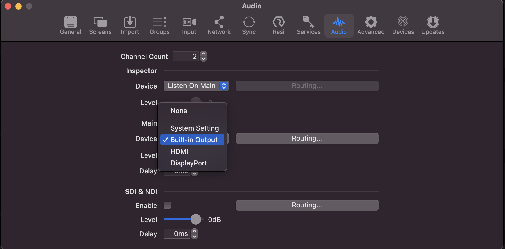

# Troubleshooting

## I need to play a video or sound from the Mac, but I can't hear any sound, or I don't see any video!

Check the following things:

1. Is everything turned on?
    * Check the "Sequencing" lightswitch
    * Check the "Projector and Camera" lightswitch
    * Make sure the Mac is on
    * Make sure the projectors are on
    * Make sure the "Mac Video Outputs" box is on (it's next to the Mac)
2. Is the "AUX" sound output muted on the sound board? Check with the person assigned to run the sound board today.
3. Is the Mac using the right audio output? It should be using the "Headphones" audio output:
    1. In the top-right corner of the Mac, look for an icon that either looks like speakers or like a pair of headphones.
    2. Click on that icon.
    3. You should see a dropdown with a few options for audio outputs. Choose "Headphones", since the Mac connects with the sound board through the Mac's headphone jack.
        
4. Is ProPresenter using the right audio output? It should be using "Built-in Output"
    1. In ProPresenter, in the top-left corner of the Mac, open the "ProPresenter" menu, and choose "Preferences" > "Audio"
        
    2. In the window that opens opens up, find the "Device" picker for the Main audio output. Open it and choose "Built-in Output".
        

## I opened up OBS Studio, but the the camera views for the podium are missing

Double-check that the "Projector and Camera" lightswitch is on. If it's off:

1. Close OBS Studio
2. Turn on the "Projector and Camera" lightswitch
3. Open OBS Studio

## I opened up OBS Studio, but I don't see a window on the left-hand monitor with all the possible camera-view options

To make this window appear if it doesn't appear automatically:

1. In OBS Studio, click the "View" menu, then click "Multiview (Windowed)"
    
2. This will open the window you want, so just drag it over onto the other monitor.

## I opened up OBS Studio, but I don't see the "Stream Information" screen, or it told me that it couldn't connect to Restream.io

1. Is the internet connection at church up?
   * Open Google Chrome on the computer and try to visit google.com
2. OBS Studio might have gotten logged out from Restream.io (the website that does our streaming broadcasts). Here's how to log back in:  
    1. From the "File" menu, choose "Settings":  
        
    2. In the "Settings" window, go to the "Stream" section, and make sure that "Restream.io" is the selected option for "Service":  
        
    3. Click the "Connect Account" button.
    4. You should see a window asking you to log in. Enter the Restream.io username and password, which you should have been given as part of your production booth training:  
        
    5. The window will ask you if you want to allow Restream.io access to the church's Google account. We have to click "Allow" here for it to work:  
        
    6. The Restream.io login window will close, and the settings window will now show a "Disconnect Account" button, and a "Server" picker, pre-filled to "Autodetect." Click "OK."
    7. This will open three new windows: Stream Information, Restream Channels, and Chat. You can drag these into place in the main OBS Studio window, which will rearrange as you drag them around.

